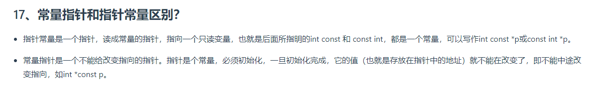
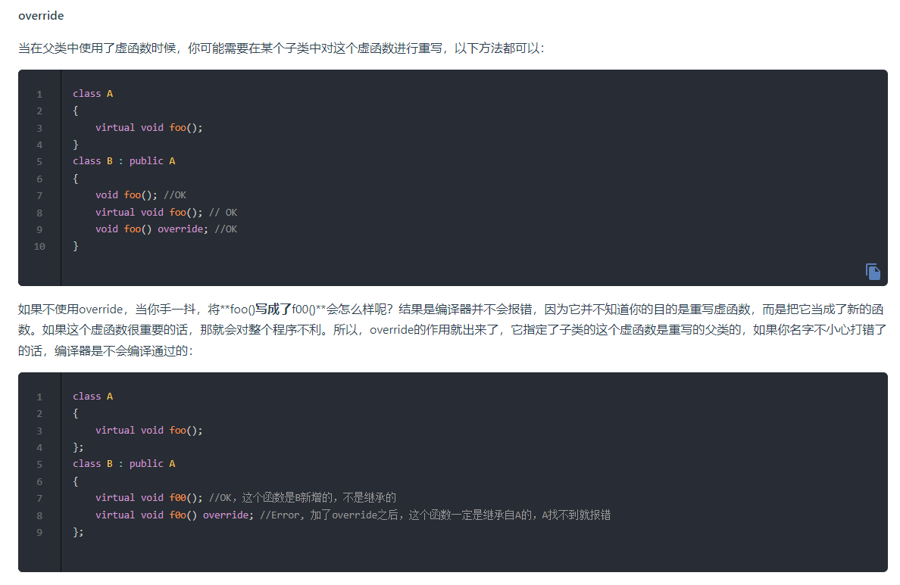

## 常量指针和指针常量的区别

## static成员函数不能被声明为const virtual volatile

[答案](<https://blog.csdn.net/Sansipi/article/details/121378929?ops_request_misc=%257B%2522request%255Fid%2522%253A%2522172467201416800178581775%2522%252C%2522scm%2522%253A%252220140713.130102334.pc%255Fall.%2522%257D&request_id=172467201416800178581775&biz_id=0&utm_medium=distribute.pc_search_result.none-task-blog-2~all~first_rank_ecpm_v1~rank_v31_ecpm-1-121378929-null-null.142^v100^pc_search_result_base1&utm_term=static%E7%B1%BB%E6%88%90%E5%91%98%E5%92%8C%E5%87%BD%E6%95%B0%E4%B8%BA%E4%BB%80%E4%B9%88%E4%B8%8D%E8%83%BD%E6%98%AFconst&spm=1018.2226.3001.4187>)

## orverride关键字的作用

## 野指针和悬空指针

[野指针和悬空指针](https://blog.csdn.net/nyist_zxp/article/details/119478944?ops_request_misc=%257B%2522request%255Fid%2522%253A%2522172467378016800175762520%2522%252C%2522scm%2522%253A%252220140713.130102334..%2522%257D&request_id=172467378016800175762520&biz_id=0&utm_medium=distribute.pc_search_result.none-task-blog-2~all~top_positive~default-1-119478944-null-null.142^v100^pc_search_result_base1&utm_term=%E6%82%AC%E7%A9%BA%E6%8C%87%E9%92%88&spm=1018.2226.3001.4187)

## 大端存储和小端存储

大端存储：数据的高位存储在低地址的地方\
小端存储：数据的地位存储在低地址的地方

## volatile关键字

volatile修辞的都是易变的变量\
volatile修辞的变量：让编译器每次操作变量时，一定要从内存中真正取出，而不是使用已经在寄存器中的值
