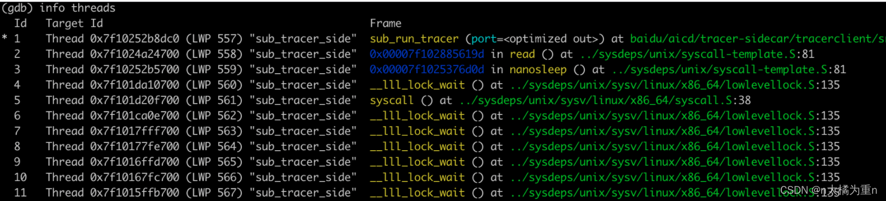
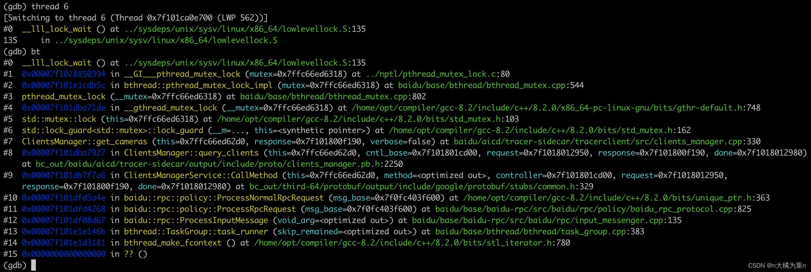
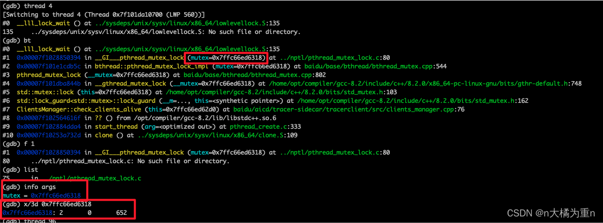
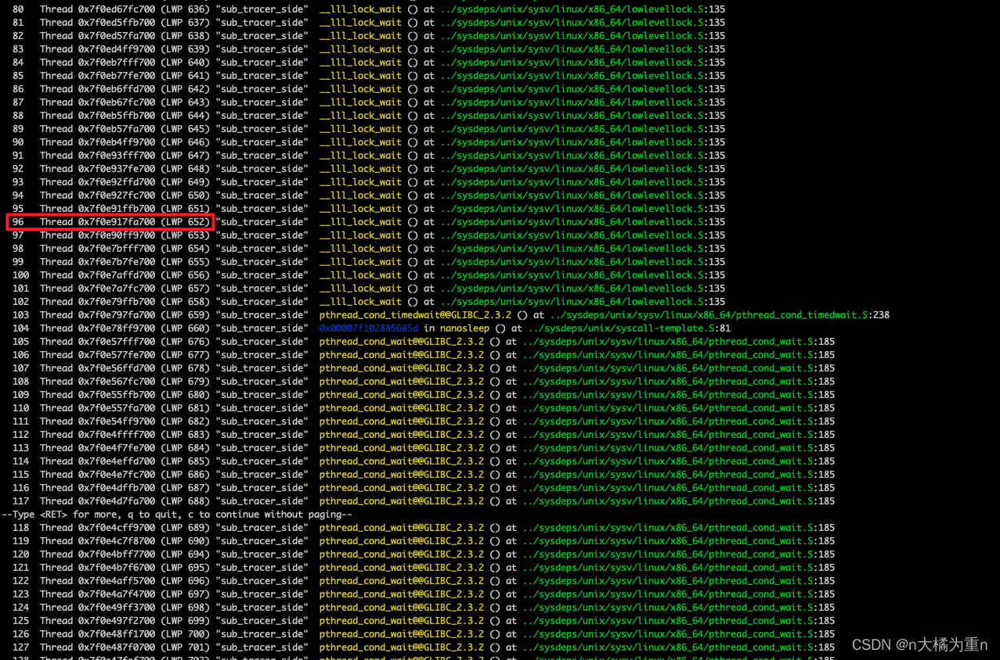

## 1、死锁用gbd怎么调试
### 死锁概念
线程之间相互等待临界资源而造成彼此无法继续执行的情况

### 出现死锁的条件
互斥条件：一个资源每次只能被一个进程使用\
请求与保持条件：一个进程因请求资源而阻塞时，对已获得的资源保持不放\
不剥夺条件：进程已获得的资源，在末使用完之前，不能强行剥夺\
循环等待条件：若干进程之间形成一种头尾相接的循环等待资源关系

https://blog.csdn.net/buknow/article/details/125184246

### gdb调试多线程死锁
首先找到出现死锁进程的pid\
ps -ef | grep a.out\
然后可以通过gdb -p 进程号，进入运行进程的gdb模式\
gdb -p 102\
使用info threads查看所有的线程运行信息\

发现有lock_wait的即是正在等待锁释放，可以thread n进入某个子线程

比如进入到6#线程中，通过bt查看当前线程的堆栈情况，可以看到锁是等在了lock guard中，然后我们可以查看mutex栈中变量，参数mutex的值，或者通过info查看参数值；然后通过x/3d命令跟参数地址打印锁的部分变量值，下面展示了这个用法，打印出来的有3个值，分别代表 __lock, __count, and __owner，第三个值就表示当前等待的锁是被哪个线程持有，注意这块的652是线程标识符，这里必须手动查询出来线程标识符信息，可以通过之前的info threads命令查询出来。


然后可以定位到是96#线程持有，还是上述的方法，thread 96，进入线程查看堆栈，然后结合代码分析线程是否存在互斥锁的范围、是否存在多个不同互斥锁的问题

## 2、stl 中的容器有哪些？
https://blog.csdn.net/wjjnbclass/article/details/137379872?ops_request_misc=%257B%2522request%255Fid%2522%253A%2522172407501716800178549128%2522%252C%2522scm%2522%253A%252220140713.130102334.pc%255Fall.%2522%257D&request_id=172407501716800178549128&biz_id=0&utm_medium=distribute.pc_search_result.none-task-blog-2~all~first_rank_ecpm_v1~rank_v31_ecpm-1-137379872-null-null.142^v100^pc_search_result_base8&utm_term=stl%E9%87%8C%E9%9D%A2%E7%9A%84%E5%AE%B9%E5%99%A8%E6%9C%89%E5%93%AA%E4%BA%9B%EF%BC%9F&spm=1018.2226.3001.4187

deque由多个连续的内存块组成，内存不足时，不需要将原来的内存复制到新的位置，不需要重新分配空间

### **注意区分`unordered_set`和`unordered_map`两者之间的区别**
`unordered_set` 和 `unordered_map` 都是C++标准库中提供的哈希表容器，但它们的用途和结构有所不同。
### 主要区别：

1. **存储的内容**：
   - **`unordered_set`**: 是一个不包含重复元素的集合。它只存储键（key），而不存储值（value）。每个键在集合中都是唯一的。
   - **`unordered_map`**: 是一个键值对（key-value pair）容器。它存储键和值，每个键都对应一个值，键在容器中是唯一的。

2. **插入方式**：
   - **`unordered_set`**: 只插入键值，例如：`mySet.insert(10);`。
   - **`unordered_map`**: 插入时需要同时指定键和值，例如：`myMap.insert({1, "value"});` 或者 `myMap[1] = "value";`。

3. **访问方式**：
   - **`unordered_set`**: 只能通过键进行查找，不能通过键获取对应的值（因为只有键）。
   - **`unordered_map`**: 通过键可以直接访问与之关联的值，例如：`myMap[1]` 会返回与键 `1` 相关联的值。

4. **使用场景**：
   - **`unordered_set`**: 用于只关心元素是否存在而不关心值的情况。例如，查找集合中是否存在某个特定的元素。
   - **`unordered_map`**: 用于需要通过键快速查找到对应值的情况。例如，使用一个电话号码查找对应的联系人姓名。

### 举例说明

**`unordered_set` 示例**:
```cpp
#include <iostream>
#include <unordered_set>

int main() {
    std::unordered_set<int> mySet = {1, 2, 3};

    // 插入一个元素
    mySet.insert(4);

    // 查找元素
    if (mySet.find(3) != mySet.end()) {
        std::cout << "3 is in the set." << std::endl;
    }

    // 输出集合中的所有元素
    for (int elem : mySet) {
        std::cout << elem << " ";
    }
    std::cout << std::endl;

    return 0;
}
```

**`unordered_map` 示例**:
```cpp
#include <iostream>
#include <unordered_map>

int main() {
    std::unordered_map<int, std::string> myMap;

    // 插入键值对
    myMap[1] = "Apple";
    myMap[2] = "Banana";
    myMap[3] = "Orange";

    // 查找键对应的值
    if (myMap.find(2) != myMap.end()) {
        std::cout << "The value for key 2 is: " << myMap[2] << std::endl;
    }

    // 输出所有键值对
    for (const auto& pair : myMap) {
        std::cout << "Key: " << pair.first << ", Value: " << pair.second << std::endl;
    }

    return 0;
}
```

### 总结

- **`unordered_set`** 适用于仅需存储唯一元素的情况，而不关心与元素相关的其他信息。
- **`unordered_map`** 则适用于需要通过键来存储和访问对应值的情况。

## 3、for循环中怎么删除容器中的一些元素
https://blog.csdn.net/weixin_57097753/article/details/140593398?ops_request_misc=%257B%2522request%255Fid%2522%253A%2522172407657816800227432469%2522%252C%2522scm%2522%253A%252220140713.130102334.pc%255Fall.%2522%257D&request_id=172407657816800227432469&biz_id=0&utm_medium=distribute.pc_search_result.none-task-blog-2~all~first_rank_ecpm_v1~rank_v31_ecpm-2-140593398-null-null.142^v100^pc_search_result_base8&utm_term=for%20%E5%BE%AA%E7%8E%AF%E4%B8%AD%E6%80%8E%E4%B9%88%E5%88%A0%E9%99%A4%E5%AE%B9%E5%99%A8%E7%9A%84%E4%B8%80%E4%BA%9B%E5%85%83%E7%B4%A0%EF%BC%9F&spm=1018.2226.3001.4187

删除元素后，更新迭代器，erase返回删除后的下一个迭代器

## 4、在遍历中如何保持迭代器有效？
https://blog.csdn.net/GreedySnaker/article/details/114967640?ops_request_misc=&request_id=&biz_id=102&utm_term=%E5%9C%A8%E9%81%8D%E5%8E%86%E4%B8%AD%E5%A6%82%E4%BD%95%E4%BF%9D%E6%8C%81%E8%BF%AD%E4%BB%A3%E5%99%A8%E6%9C%89%E6%95%88%EF%BC%9F&utm_medium=distribute.pc_search_result.none-task-blog-2~all~sobaiduweb~default-0-114967640.142^v100^pc_search_result_base8&spm=1018.2226.3001.4187

erase(*it )的返回值是下一个有效迭代器的值 直接``it = erase(**it)``即可令it指向迭代器的下一个位置
```c++
void vectorIter()
{
	vector<int> vec;
	for (int i = 0; i < 10; i++)
	{
		vec.push_back(i);//0，1，2，3，4，5，6，7，8，9
	}

	for (auto it = vec.begin(); it != vec.end(); it++)
	{
		if (*it == 5)
		{
			it =vec.erase(it);//删除5后迭代器指向6
			it = vec.insert(it,0);//插入0后迭代器指向0
			//直接erase或者insert会崩溃，因为迭代器失效了
		}
	}

	for (auto it = vec.begin(); it != vec.end(); it++)
	{
		cout << *it << endl;
	}

}
```

## 5、容器是线程安全的吗？
[容器是否线程安全](https://blog.csdn.net/weixin_42195477/article/details/130718214?ops_request_misc=%257B%2522request%255Fid%2522%253A%2522172407719316800222828377%2522%252C%2522scm%2522%253A%252220140713.130102334.pc%255Fall.%2522%257D&request_id=172407719316800222828377&biz_id=0&utm_medium=distribute.pc_search_result.none-task-blog-2~all~first_rank_ecpm_v1~rank_v31_ecpm-1-130718214-null-null.142^v100^pc_search_result_base8&utm_term=%E5%AE%B9%E5%99%A8%E6%98%AF%E7%BA%BF%E7%A8%8B%E5%AE%89%E5%85%A8%E7%9A%84%E5%90%97%EF%BC%9F&spm=1018.2226.3001.4187)

## 6、C++多态
[C++多态理解](https://blog.csdn.net/zhang_si_hang/article/details/126173598?ops_request_misc=%257B%2522request%255Fid%2522%253A%2522172413490516800178586694%2522%252C%2522scm%2522%253A%252220140713.130102334..%2522%257D&request_id=172413490516800178586694&biz_id=0&utm_medium=distribute.pc_search_result.none-task-blog-2~all~top_positive~default-1-126173598-null-null.142^v100^pc_search_result_base8&utm_term=C%2B%2B%E5%A4%9A%E6%80%81&spm=1018.2226.3001.4187)

多态是在不同继承关系的类对象，去调用同一函数，产生了不同的行为。比如 Student 继承了 Person。 Person 对象买票全价， Student 对象买票半价\
### 多态两个要求：
 1、被调用的函数必须是虚函数，子类对父类的虚函数进行重写 （重写：三同（函数名/参数/返回值）+虚函数）\
 2、父类指针或者引用去调用虚函数。