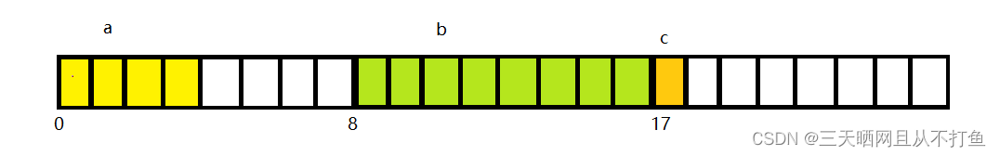
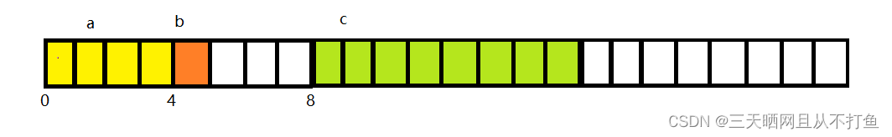

# 内存对齐
## 1、先看这样一个例子
```C++
typedef struct S{
    int a;
    double b;
    char c;
};S

typedef struct B{
    int a;
    char b;
    double c;
};B

int main()
{
    std::cout<<sizeof(S)<<std::endl; //24
    std::cout<<sizeof(B)<<std::endl; //16
    return 0;
}
```
\
\
**结构体S的内存**\
\
对结构体S来说：
a变量占四个字节，b变量的对齐数为8，所以b应该从偏移量为8处开始储存（4~7均不是对齐数的整数倍）,c变量的对齐数为1，所以c应该从偏移量为17处开始储存，所以得到的应该是17，根据规则 5.结构体的总大小，应该是实际最大对齐数的整数倍大小，不足则补位 而17不是8的整数倍，所以补位成8的整数倍，所以sizeof（S）输出24.

**结构体B的内存**\
\
对结构体B来说：
a变量占四个字节，b变量的对齐数为1，所以b应该从偏移量为4处开始储存,c变量的对齐数为8，所以c应该从偏移量为8处开始储存，所以得到的应该是16，根据规则 5.结构体的总大小，应该是实际最大对齐数的整数倍大小，不足则补位 16是8的整数倍，所以sizeof（B）直接输出16.

系统在为结构体分配内存的时候，是按照其定义的顺序进行分配，同时结构体内变量也有其对应的内存对齐规则 \
常见基本类型字节：\
数据类型    ILP32（32位Linux系统）	LP64（大部分64位Linux系统）	LLP64（64位Windows系统）\
char	   1 字节	                1 字节	                1 字节\
short	   2 字节	                2 字节	                2 字节\
int	       4 字节	                4 字节	                4 字节\
float	   4 字节	                4 字节	                4 字节\
long	   4 字节	                8 字节	                4 字节\
double	   8 字节	                8 字节	                8 字节\
long long  8 字节	                8 字节	                8 字节\
指针 point  4 字节	                8 字节	                8 字节\
枚举 enum	4 字节	                4 字节	                4 字节\
联合体 union	取 union 中最大一个变量类型大小	取 union 中最大一个变量类型大小	取 union 中最大一个变量类型大小\

## 2、内存对齐的默认规律
下面的结论均为系统默认对齐规则下进行的：

通常情况：我总结的规律如下：结构体中间：各结构体的起始地址按照各个类型变量默认规则进行摆放，但除了 char 类型变量（详见一），char 类型变量一般遵循 2 的倍数地址开始存储。详见例2。结构体最后（重要）：视结构体中最大类型是哪一个，如果是像 int 类型那样是 4 个字节的，并且结构体的结尾地址不满足 4 的倍数的话，向离最近的 4 的倍数地址补齐；如果是像 double 类型那样是 8 个字节的，并且结构体的结尾地址不满足 8 的倍数的话，向离最近的 8 的倍数地址补齐；以此类推

结构体嵌套：子结构体的成员变量起始地址要视子结构体中最大变量类型决定，比如 struct a 含有 struct b，b 里有 char，int，double 等元素，那 b 应该从 8 的整数倍开始存储。

含数组成员：比如 char a[5]，它的对齐方式和连续写 5 个 char 类型变量是一样的，也就是说它还是按一个字节对齐。

含联合体（union）成员：取联合体中最大类型的整数倍地址开始存储。

## 3、内存对齐的好处：
1、不是所有的硬件平台都支持随意地址访问，有些硬件平台cpu只能从指定地址处读取指定大小的数据，减少了异常抛出。\
2、提高结构体成员的访问效率，访问未对齐的内存时可能需要进行两次访问操作，内存对齐之后只需要进行一次访问。

 