# 一、题目

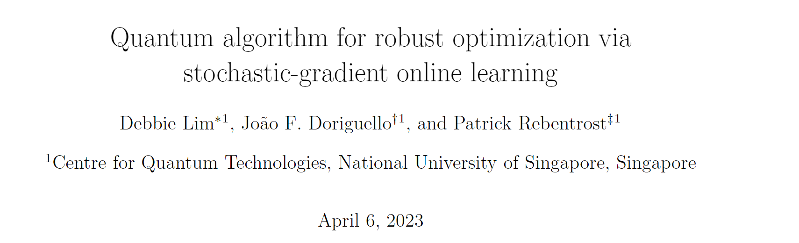

# 二、论文讨论的问题

本文给出了一个在线鲁棒优化的量子版本，在线鲁棒优化是一种处理具有不确定性的变量或参数的优化理论分支。

> 在线鲁棒优化是鲁棒优化和在线优化两个概念的结合体。
>
> ### 鲁棒优化
>
> 鲁棒优化是一种优化方法，它旨在使解决方案对不确定性具有更强的适应能力。通常，在解决优化问题时，假定所有输入数据都是已知且固定的。但在现实中，许多参数可能是不确定的，或者只能知道一个范围的
> 值。鲁棒优化的目标就是在这些不确定性条件下找到一个解决方案，使得最坏情况下的性能也是可以接受的。
>
> 在鲁棒优化中，通常会定义一个所谓的“不确定性集”，这个集合包含了所有可能的真实值。我们的目标是找到一个解决方案，即使在不确定性集中的任意参数取值下，也能保证一定的性能。
>
> **任务具体形式如下：**\
> 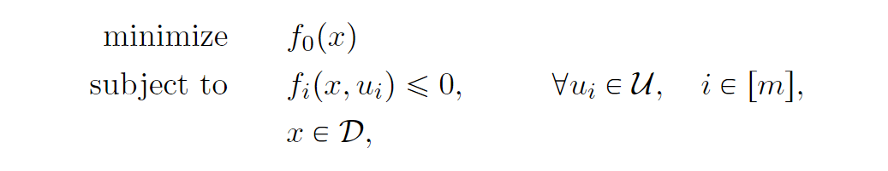\
> 这里需要做两个工作，所有约束都必须适用于集合中的每个参数，$f_{i}(x,u_{i})$有两个参数，一个是$x$，一个是$u_{i}$，那么需要对这两个参数都进行相应的更新，找到参数满足$f_{i}$。
>
>### 在线优化
>
>在线优化是一种处理随时间变化的数据或环境的优化方法。与离线优化不同，在线优化不需要提前知道所有的数据，而是随着数据逐渐到达，逐步调整解决方案。
>
>在线优化算法通常会衡量一个策略的好坏，比如通过比较它与事后最优策略（即如果有全部信息时的最佳策略）的差距，这个差距通常称为“regret”。
>
>### 在线鲁棒优化
>
>在线鲁棒优化结合了在线优化和鲁棒优化的特点。在这种情况下，不仅要处理随时间变化的数据（在线），还要考虑到这些数据中的不确定性（鲁棒）。换句话说，试图在不知道未来数据的情况下做出决策，同
>时确保这些决策在面对不确定性时依然有效。
>
>在线鲁棒优化的一个关键挑战是找到一种方法，使得算法能够在数据不断到达的过程中快速做出反应，同时保持对不确定性的鲁棒性。例如，在金融投资组合管理中，投资者可能需要在市场条件不断变化的情况下调整他们的投资策略，同时确保这些策略在各种可能的市场波动中都能表现良好。

# 三、论文细节

## 1、Ben-Tal et al.的经典在线鲁棒优化算法
>
> Ben-Tal et al. 提出了一种鲁棒优化元算法，这是一种在线算法，它利用了原优化 问题的子梯度下降作为子程序。在这个算法中，噪声参数 $(
>  u_1^{(t)},\ldots,u_m^{(t)} )$ 在每次迭代 $( t )$ 中都会被更新，使用在
> 线子梯度下降的方式：\
> $u_i^{(t+1)} = P_U(u_i^{(t)} + \eta^{(t)} \nabla_u f_i(x^{(t)},u_i^{(t)}))$
>
>其中 $( P_U(u) )$ 是欧几里得投影操作符，将 $( u )$ 投影到集合 $( U )$
>上，而 $( \eta^{(t)} )$ 是步长。一旦得到新的噪声参数 $( u_1^{(t+1)},
> \ldots,u_m^{(t+1)} )$，假设存在一个针对原始凸优化问题的优化 oracle $( O_c )$，给定输入 $( (u_1,\ldots,u_m) \in U^m )$，输出满足以下约束的 $( x \in D )$ 或者标记为 INFEASIBLE：
>
>$f_i(x,u_i) \leqslant \epsilon, \quad i=1,\ldots,m$
>
>如果不存在这样的 $( x \in D )$ 使得 $( f_i(x,u_i) < 0 )$，则标记为 INFEASIBLE。
>
>Ben-Tal et al. 已经证明了这样一个在线元算法能够正确地得出原始程序是否无解
>或输出一个 $( \epsilon )$-近似的解，只需要 $( O(D^2G_2^2/\epsilon^2)
>)$ 次调用优化 oracle $( O_c )$，其中 $( D )$ 是集合 $( U )$ 的直径，而 $( G_2 \geqslant \|\nabla_u f_i(x,u)\|_2 )$ 对于每一个 $( x \in D )$ 和 $( u \in U )$ 是子梯度 $( \ell_2 )$-范数的上界。
>
>### 1.1 投影算子
>
>欧氏投影是一个将一个向量映射到某个集合的过程，使得映射后的向量与原始向量之间的距离最小。
>文中，欧氏投影用于确保更新后的参数值$u_{i}^{t+1}$仍然属于定义域$U$。公式表示为：
>$P_U(u) = argmin_{v in U} ||u - v||_2^2$
>其中 $P_U(u)$ 是欧氏投影运算符，它找到集合 $U$ 中最接近给定向量 $u$ 的点 $v$。
>在迭代过程中，噪声参数 $u_{i}^{t}$ 根据梯度下降法进行更新，并通过欧氏投影保证新值位于定义域 $U$ 内。有助于约束优化过程并防止参数超出允许范围。

## 2、本文算法

### 2.1 参数设置

> 1. $m$: 噪声向量的数量。
> 2. $d$: 向量的维度。
> 3. $D$: 集合$U$ 的$\ell_2$-直径上的上界。
> 4. $G_2$: 每个子梯度的$\ell_2$-范数的最大值。
> 5. $G_1$: 所有子梯度$\ell_1$-范数之和的最大值。
> 6. $G_{\infty}$: 单个子梯度$\ell_1$-范数的最大值。
> 7. $\delta$: 量子算法的失败概率。
> 8. $\mathcal{U},\mathcal{D}$都是凸集。(凸集的局部最优解也即全局最优解)\
> (一个集合是凸的，意味着集合内任意两点之间线段上的所有点都在集合内。更正式地讲，如果集合 $S$ 包含两个点 $x$ 和 $y$，以及任意实数 $\lambda (0 ≤ \lambda ≤ 1)$，那么集合 $S$ 必须也包含点 $\lambda x + (1-\lambda)y$。即从集合 $S$ 中的一个点沿着任何方向移动到另一个点的过程中，路径上的所有点都必须也在集合 $S$ 内。)

> 几个***oracle***:
>
> 1. 随机子梯度***oracle*** $O_{g}$：用于产生随机向量$g_{1},...g_{m}$，这些向量的期望值和真实的子梯度$\nabla _{u} f_{1}(x,u),...,\nabla _{u} f_{m}(x,u)$成比例。
> 2. **Subgradient oracle** $( \mathcal{O}_{\nabla} )$: 这是一个用于计算子梯度的 oracle，它可以返回函数 $( f_i(x, u_i) )$ 关于变量 $( u_i )$ 的某个方向导数值。在量子采样基的算法中，被用于多次采样以获取子梯度的近似值。
> 3. **Projection oracle** $\mathcal{O}_{P}$: 它用于执行投影操作，即将一个点从空间$\mathbb{R}^d$ 投影到集合 $U$ 上。
> 4. **Optimization oracle** $\mathcal{O}_{\epsilon}$: 这是一个优化 oracle，它负责检查给定的点 $x$ 是否满足约束条件，即判断是否存在 $x$ 使得 $f_i(x, u_i) \leqslant \epsilon$ 对于所有$i \in [m]$。在算法中使用了这个 oracle 来确定当前解是否满足要求。

### 2.2 Online stochastic subgradient descent

>介绍了该算法的一个随机次梯度变体，在每次迭代中，使用一个随机向量来近似实际的次梯度。具体来说，给定一个参数 $(\nu \in [0, 1/2])$ 和一个凹函数 $(h^{(t)})$，假设可以访问带有噪声的次梯度oracle $(O_g^{(t)})$，该oracle在每一步 $(t)$ 生成的次梯度满足以下两个条件：
>
> 1. **期望条件**：随机次梯度的期望值与实际的梯度成比例，比例因子为 $(\lambda^{(t)})$，其中 $(\lambda^{(t)})$ 和 1 的差异至多为 $(\nu)$。
>
> 2. **方差条件**：次梯度的二范数的平方有一个上界 $(\tilde{G}_2^2)$。

> ***算法流程---algorithm1***：用于找到效果好的$u^{t},t \in \{0,T\}$
> 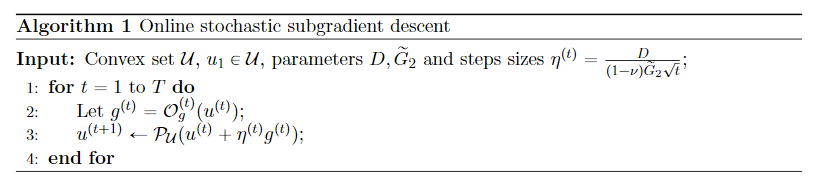\
> 具体来说，算法接收一个凸集 $\mathcal{U}$、初始点$u_1 \in \mathcal{U}$、参数 $D$、$\tilde{G}_2$ 和步长$\eta^{(t)}=\frac{D}{(1-\nu)\tilde{G}_2\sqrt{t}}$。在每次迭代中，先用带噪声的此梯度oracle $\mathcal{O}_{g}^{t}$ 产生次梯度的近似$g^{(t)}$，然后将其应用于投影操作来更新 $u^{(t+1)}$。这个过程重复 $T$次。\
>其中$P_{ \mathcal{U}}(u) = argmin_{\mathcal{v}\in \mathcal{U}} \left \| u - \mathcal{v}\right\|_{2}$，算法的每次迭代都沿着梯度的方向移动，每次移动的过程中，可能会移出凸集，所有需要进行投影操作，确保移动后的点仍然在凸集中。\
>在线随机梯度下降算法在满足特定假设的情况下具有良好的性能。引理指出，在 $h(u)$ 是凹函数且 $g^{(t)}$ 满足期望条件时，算法的性能可以通过以下公式衡量：
>
>$\max_{u^* \in \mathcal{U}} \frac{1}{T}\sum_{t=1}^{T}h^{(t)}(u^*) - \frac{1}{T}\sum_{t=1}^{T}\mathbb{E}[h^{(t)}(u^{(t)})] \leqslant \frac{3(1+4\nu)\tilde{G}_2D}{2\sqrt{T}}.$
>
>这个引理表明，随着 $T$ 的增加，算法的平均损失会逐渐收敛到最优解的损失。
>这个算法的目的，找到效果足够好的噪声参数$u$，算法2的subroutine。

> 证明过程----->>>论文里
> 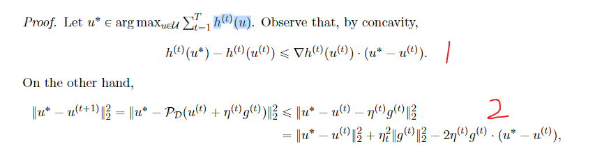\
> $h^{(t)}(u^*) - h^{(t)}(u^{(t)}) \leqslant \nabla h^{(t)}(u^{(t)}) \cdot (u^* - u^{(t)})$。（$h$为凹函数并且可微即成立）
> 等式(2):将$u^{t+1}$拆开，又投影算子为实际移动的近似，再将平方项拆开。
> 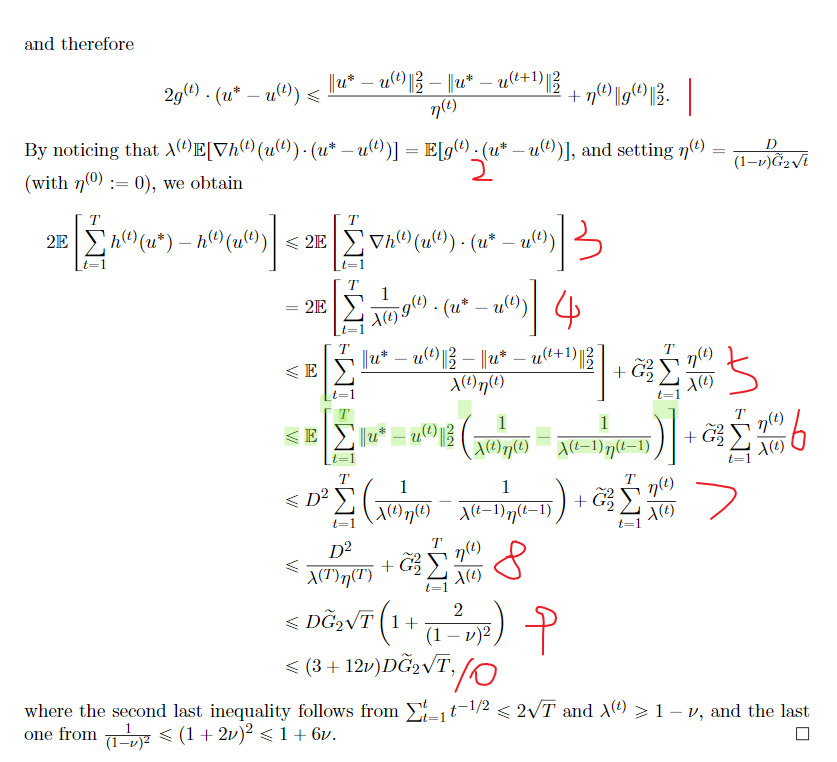\
> 等式(1):上面等式(2)移项后同时除$\eta^{t}$，加上$g^{t}$为近似子梯度，可以推到后面得到不等式成立，即算法1更新出来的$u$是一个***good u***。

## 2.3 A stochastic dual-subgradient meta-algorithm(随机双梯度元算法)

> 这里提出了一种随机双梯度元算法，用于解决方程（1）。\
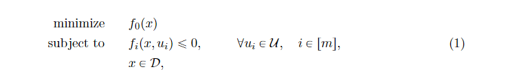\
与 Ben-Tal et al. [6] 原始方法的不同之处在于，不再精确地计算子梯度 $\nabla_u f_i(x,u)$，而是使用一个满足特定条件的随机子梯度 oracle $O_g$。该 oracle 输入 $(x, u_1, ..., u_m)$，***输出 $g_1, ..., g_m \in \mathbb{R}^d$***，这些 $g_i$ 满足以下条件：
>
>1. 对所有 $i \in [m]$，期望$g_i$ 是 $\lambda \nabla_u f_i(x, u_i)$ 的近似，其中 $\lambda$ 的绝对值不超过 $1-\nu$；并且
>2. $g_i$ 的期望 $L_2$ 范数上界为$G_2$。
>
>$\lambda$不需要固定或已知，可以在每次调用 oracle 时改变。算法如算法 2 所示。下面的定理表明，算法 2 解决了鲁棒优化问题（2）。
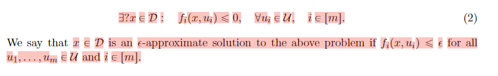\
是否存在$x \in D$，对于任意的$u_{i}\in U$，有$f_{i}(x,u_{i}) \le 0$

### 2.3.1 参数引入

> 1. $f_{i}$是一个凸函数
> 2. $\mathcal{D}$ and $\mathcal{U}$为凸集
> 3. $\| f_{i}(x,u) \| \le F$，即$F$为$f_{i}$绝对值的upper bound。
> 4. $max_{u,v \in \mathcal{U}} \left \| u-v \right \|_{2} \le D$，即$D$为凸集$\mathcal{U}$中直径的upper bound
> 5. 随机次梯度oracle$\mathcal{O}_{g}$，输入为$(x,u_{1},...,u_{m})$，输出为$g_{q},...,g_{m} \in R^{d}$

### 2.3.2 算法2

> 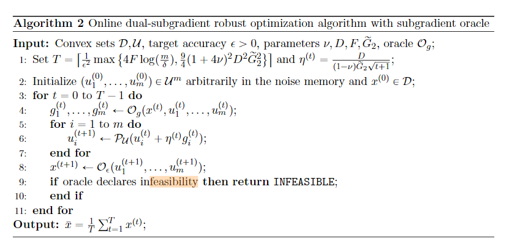
> 先生成噪声参数$u$，然后通过噪声参数$u$，加上使用优化oracle$\mathcal{O}_{\epsilon}$去判断当前$t$是否存在$x$满足约束条件，如果不满足约束条件，直接返回INFEASIBLE表示不可行。\
> ***优化oracle***:负责检查给定的点 $x$ 是否满足约束条件，即判断是否存在 $x$ 使得 $f_i(x, u_i) \leqslant \epsilon$ 对于所有$i \in [m]$。在算法中使用了这个 oracle 来确定当前解是否满足要求。

> 如果有可行的$x$,有$\bar{x} = \frac{1}{T} \sum_{t=1}^{T}x^{t}$满足$f_{i}(\bar{x},u_{i})$。\
> 证明过程: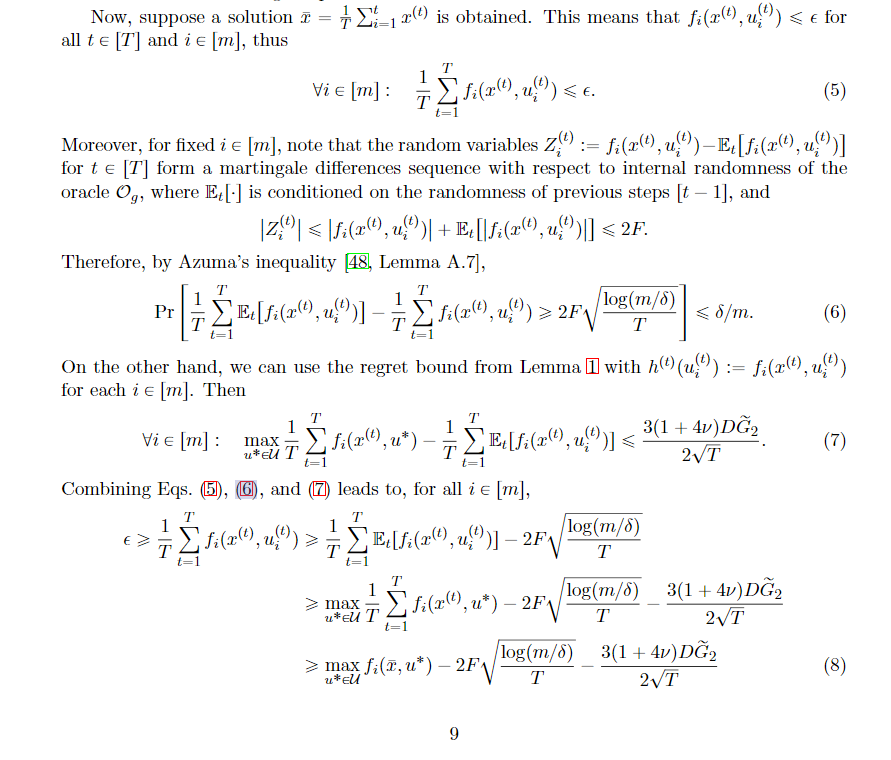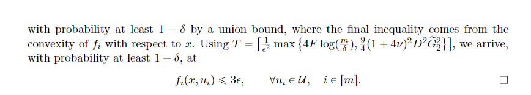

## 2.4 Quantum online robust optimization

> 此量子在线算法用于求解鲁棒凸优化问题。算法的主要思想是构建一个随机梯度 oracle $O_g$，通过从向量 $\nabla_u f_1(x,u_1),...,\nabla_u f_m(x,u_m)$ 中进行$\ell_1$采样，并使用采样项构造一个随机梯度。此外，算法还需要一个子程序来估计向量的$\ell_1$范数。

### 2.4.1 几个fact和theorem
>
> 1. 存在量子算法，可以输出 s 份状态 $\sum_{i=1}^n \sqrt{\frac{u_{i}}{\|u\|_1}} \left |i  \right \rangle$，其中 $s,n \in \mathbb{N}$，$\delta \in (0,1)$ 是一个小的正数，$u$ 是非零的 n 维向量。这个算法可以在 O($\sqrt{sn log(1/\delta)}$) 时间内完成，并且成功概率至少为 1-$\delta$。
> 2. 存在量子算法，接受一个非零向量 $u \in \mathbb{R}^n$ 作为输入，其 $\ell_1$ 范数不超过 M。给定一个估计 oracle，该算法可以在 O($T_u\nu^{-1}\sqrt{nM/\|u\|_1\log(1/\delta)}$) 时间内输出一个标量 $\Gamma \in \mathbb{R}_{>0}$，使得 $|\Gamma - \|u\|_1| \leq \nu\|u\|_1$ 的概率至少为 1-$\delta$。这里的 $T_u$ 表示估计 oracle 的时间复杂度。
> 3. 对于 $i \in [m]$，$f_i : D \times U \rightarrow \mathbb{R}$ 是一个定义
> 在凸集 $D \subseteq \mathbb{R}^n$ 和参数来自凸集 $U \subseteq \mathbb{R}
> ^d$ 的凸函数，直径为 $\max_{u,v \in U} \|u-v\| \leq D$。同时，存在常数 $F, > G_2 > 0$，使得对于所有 $x \in D$ 和 $u \in U$，都有 $|f_i(x, u)| \leq F$
> 和 $\|\nabla_u f_i(x, u)\|_2 \leq G_2$。另外，还有常数 $G_1^{(i)} > 0$，使> 得对于所有 $x \in D$ 和 $u \in U$，$\|\nabla_u f_i(x, u)\|_1 \leq G_1^
> {(i)}$，并定义 $G_1 := \sum_{i=1}^m G_1^{(i)}$ 和 $G_{\infty} := \max_{i > \in [m]} G_1^{(i)}$。\
> 给定整数 $s$，算法运行次数 T 由以下公式确定：
>
> $T = \left\lceil \frac{1}{\epsilon^2} \max \left\{ 4F\log\left(\frac{m}{\delta}\right), \frac{225D^2}{16}\left(G_2^2+\frac{G_1G_{\infty}-G_2^2}{s}\right) \right\} \right\rceil$.
>
>对于给定的精度 $\epsilon$ 和失败概率 $\delta$，算法能够在多项式时间内找到一个解，该解在很大概率上满足所有约束条件。

### 2.4.2 算法3:Quantum online sampling-based dual subgradient robust optimization algorithm
>
> 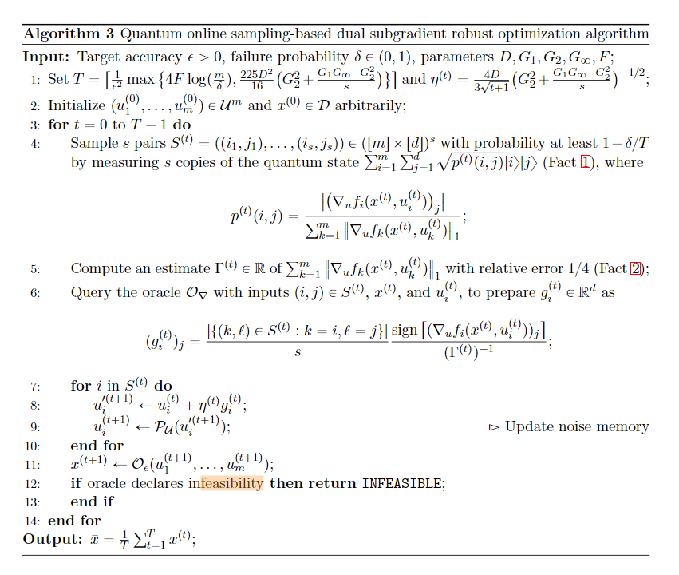
> 输出参数:失败概率$\delta$，目标精确度$\epsilon$，其他参数含义参考上面。\
> \
> ***算法流程***：
> 1. 首先设置步伐$\eta^{(t)}$和总时间步$T$
> 2. 初始化噪声向量$(u_{1}^{(0)},...,u_{m}^{(0)})$和$x^{0}$
> 3. 对测量后的结果进行采样，采样数目为$s$，其中$S^{(t)} = ((i_{1},j_{1}),...,(i_{s},j_{s}))$，测量的量子态为$\sum_{i=1}^{m}\sum_{j=1}^{d}\sqrt{p^{(t)}(i,j)}\left |i  \right \rangle\left |j  \right \rangle$，其中$p^{(t)}(i,j) = \frac{|(\nabla_{u}f_{i}(x^{(t)},u_{i}^{(t)}))_{j}|}{\sum_{k=1}^{m} \|  \nabla_{u}f_{k}(x^{(t)},u_{k}^{(t)})\|_{1}}$。\
> ps:一范数为绝对值求和，$p^{(t)}(i,j)$表示求绝对值+单位化后的次梯度$(\nabla_{u}f_{i}(x^{(t)},u_{i}^{(t)}))_{j}$。
> 4. 对次梯度的一范数$\nabla_{u}f_{k}(x^{(t)},u_{k}^{(t)})$进行估计
> 5. 查询优化Oracle $\mathcal{O}_{\nabla}$，其中优化oracle输入为$(i,j)\in S^{(t)}$、$x^{t}$和噪声参数$u_{i}^{(t)}$，输出为次梯度向量的估计$g_{i}^{(t)}\in R^{d}$
> 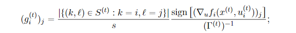
> 6. 依次更新...